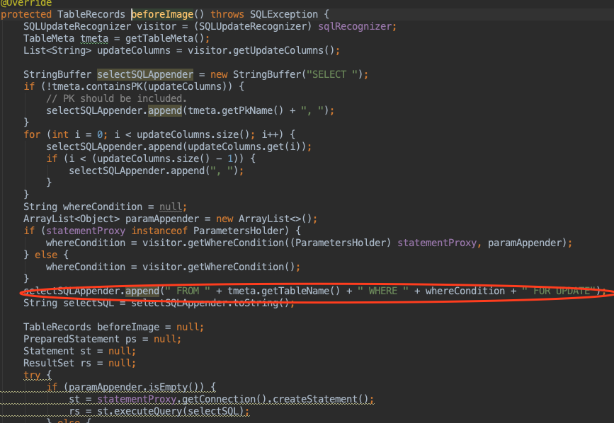

## 关于ReadUnCommit

|事务隔离级别	| 脏读 |	不可重复读	| 幻读 |
|---|:---:|:---:|:---:|
|读未提交（read-uncommitted）|是	|是 |是|
|不可重复读（read-committed）	|否	|是	|是|
|可重复读（repeatable-read）	|否	|否	|是|
|串行化（serializable）	   |否	|否	|否|

## 全局读未提交事故

充值与佣金,原始0
场景: 购买物品需要先充值个人账户,再生成订单发生扣款

- XID=1 A 充值100块 A+100=100,1%手续费 佣金账户Z+1 本地事务成功
- XID=2 B 佣金账户提现 1元Z-1=0 事务成功
- XID=1 A 购买100块 A-100=0 本地事务成功
- XID=1 A 生成购买订单 失败,回滚,全局事务回滚

## 读已提交(不可重复读,同一事务内读取到不同的数据)

使用Select For Update读已提交级别时

- XID=1 A 充值100块 A+100=100,1%手续费 佣金账户Z+1 本地事务成功
- XID=2 B 佣金账户提现 0元Z 无法提现
- XID=1 A 购买100块 A-100=0 本地事务成功
- XID=1 A 生成购买订单 失败,回滚,全局事务回滚

当资源被共享或者该资源更新依赖了可能存在他人更新的数据时,务必使用读已提交,并且需要注意性能问题。乐观锁方案在此处无效。

## 可重复读 Mysql InnoDB MVCC

## 串行化 next key lock

